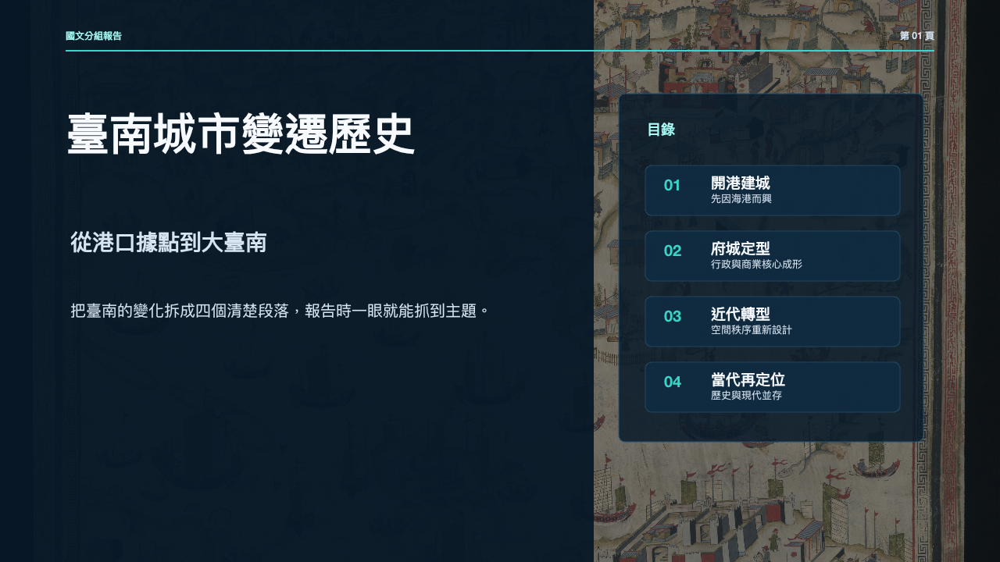
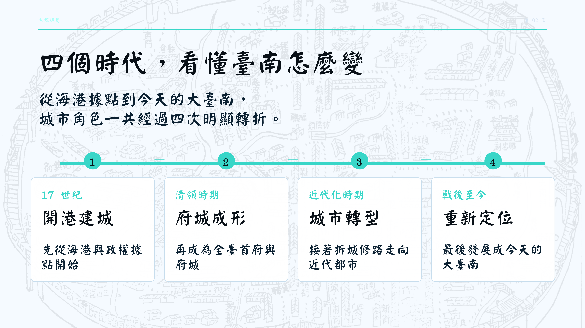
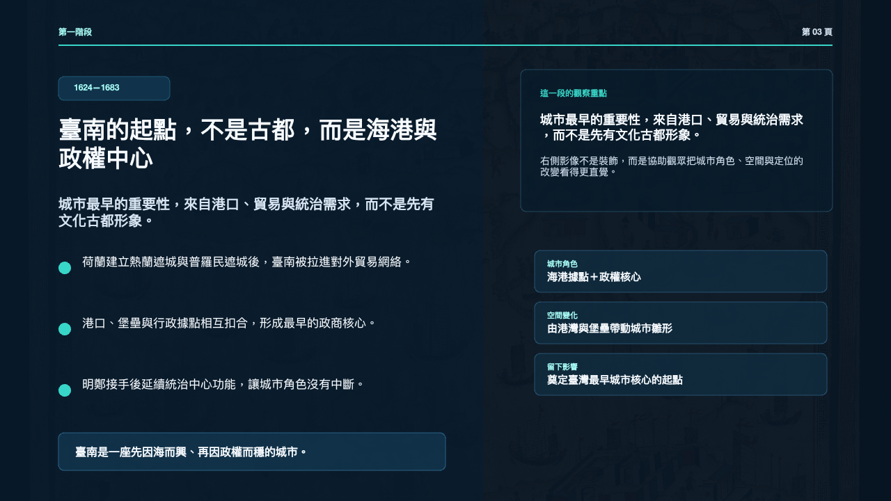
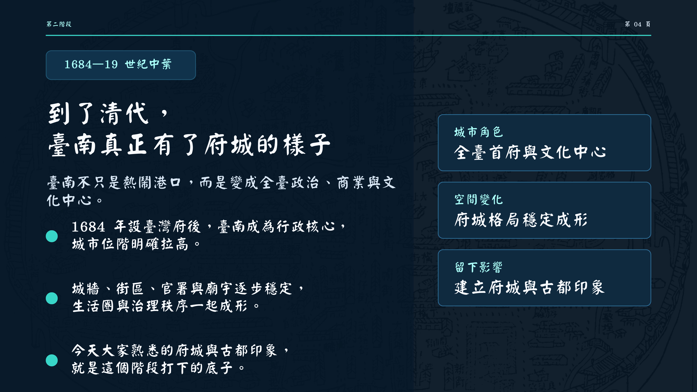
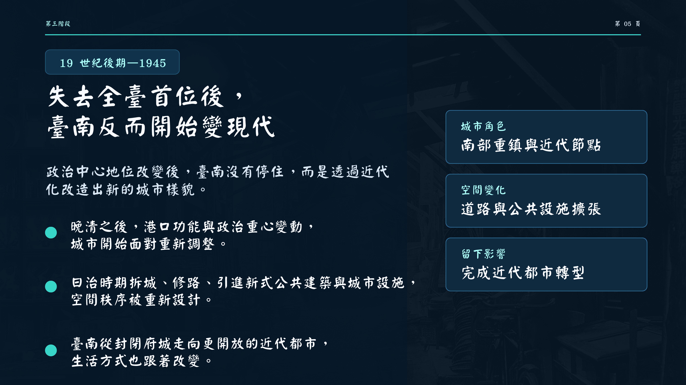
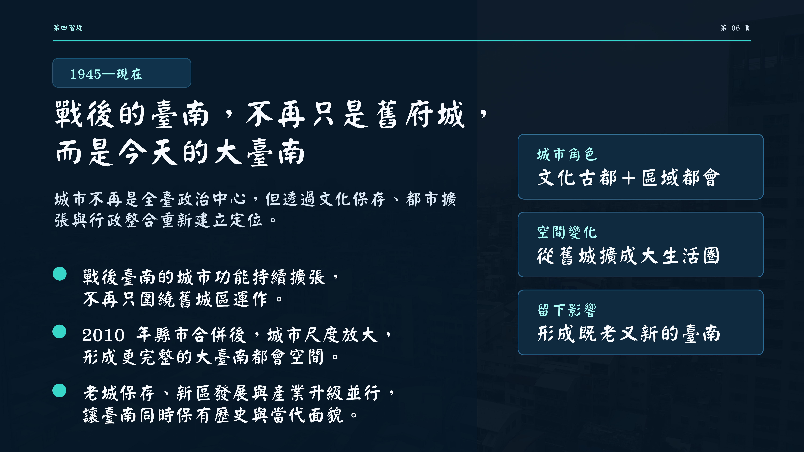
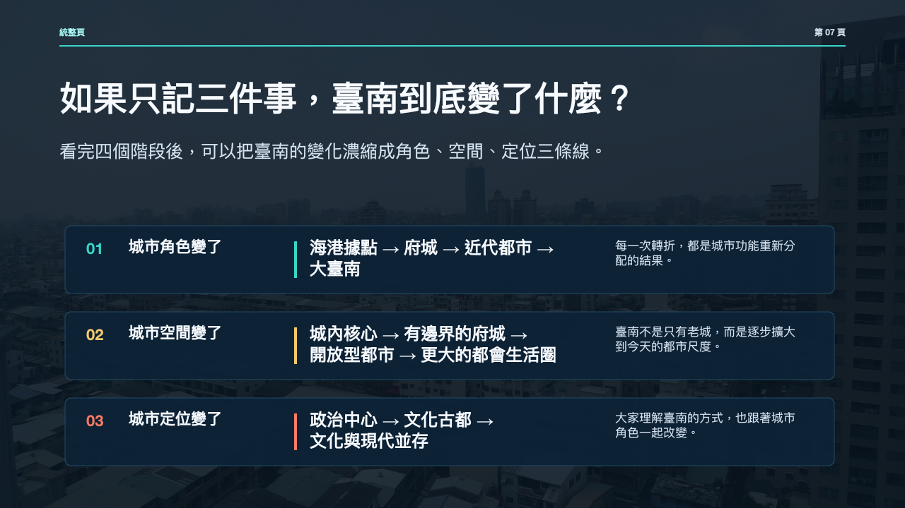
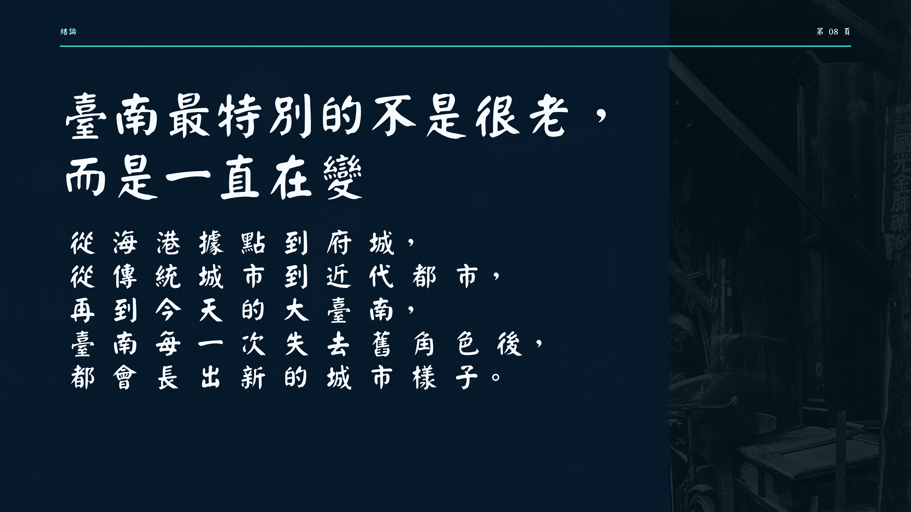
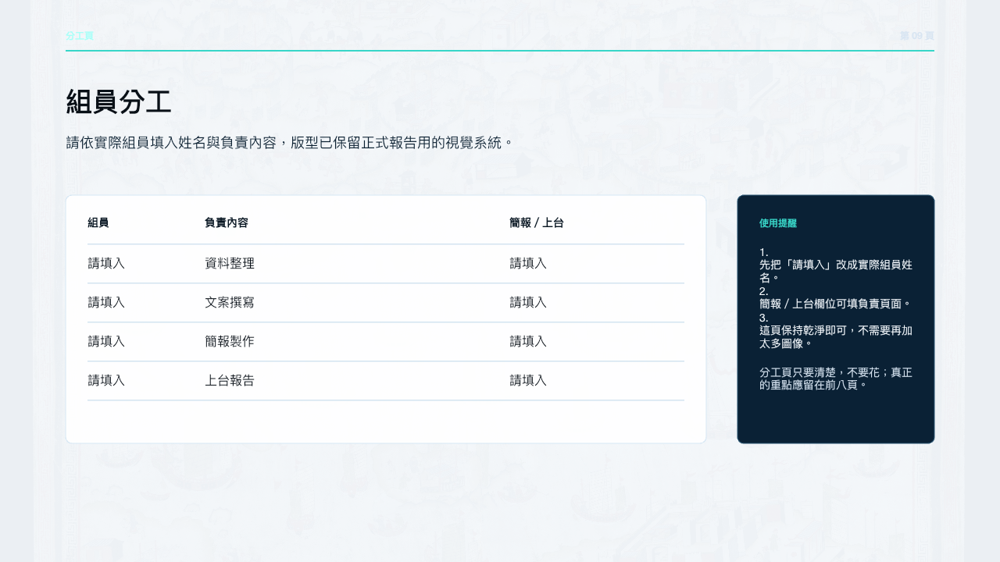

# 國文報告專案

國文報告專案。

## 內容
- `final/`：最終報告包、逐頁簡報文案、上台提示句、雲端簡報連結
- `research/`：研究骨架、視覺支援包

## 簡報
- 線上觀看：[Canva 簡報](https://canva.link/rpf42nnri6doj57)
- PDF 觀看：[臺南城市變遷歷史簡報.pdf](final/%E8%87%BA%E5%8D%97%E5%9F%8E%E5%B8%82%E8%AE%8A%E9%81%B7%E6%AD%B7%E5%8F%B2%E7%B0%A1%E5%A0%B1.pdf)
- 原始簡報：[臺南城市變遷歷史簡報.pptx](final/%E8%87%BA%E5%8D%97%E5%9F%8E%E5%B8%82%E8%AE%8A%E9%81%B7%E6%AD%B7%E5%8F%B2%E7%B0%A1%E5%A0%B1.pptx)
- 打包圖片：[臺南城市變遷歷史簡報.zip](final/%E8%87%BA%E5%8D%97%E5%9F%8E%E5%B8%82%E8%AE%8A%E9%81%B7%E6%AD%B7%E5%8F%B2%E7%B0%A1%E5%A0%B1.zip)
- 連結備註：見 `final/臺南城市變遷歷史簡報-雲端連結.txt`

